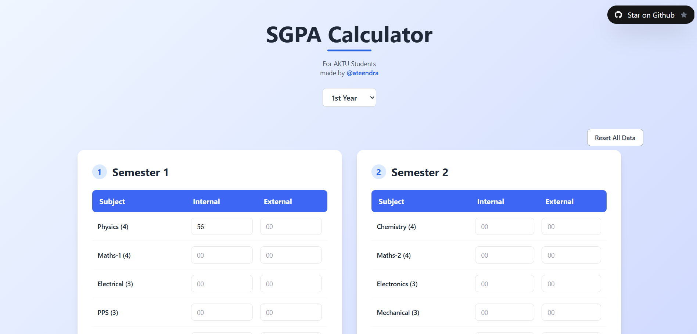

# SGPA Calculator (AKTU BTech)

A modern, user-friendly web app to calculate your Semester Grade Point Average (SGPA) and Yearly GPA (YGPA) for AKTU BTech students.

[🔗 Live Demo](https://sgpa-calculator-mu.vercel.app/)



---

## 🚀 Features

- **Beautiful, Responsive UI** – Built with React, Vite, and Tailwind CSS
- **Supports All Years** – Calculate SGPA and YGPA for 1st to 4th year (all 8 semesters)
- **Auto-Save Progress** – Your marks and results are saved in your browser (localStorage)
- **Reset Per Year** – Easily clear all data for any year with a single click
- **Input Validation** – Prevents invalid marks and ensures accurate calculations
- **Fast & Secure** – No login required, all data stays on your device

---

## 📝 How to Use

1. **Select Your Year** (1st, 2nd, 3rd, or 4th)
2. **Enter Your Marks** for each subject (internal and external)
3. **Click “Calculate SGPA”** for each semester
4. **Click “Calculate YGPA”** to get your yearly GPA
5. **Switch Years** – Your data for each year is saved automatically
6. **Reset** – Use the “Reset All Data” button (top right) to clear data for the current year

---

## 🛠️ Tech Stack

- [React](https://react.dev/)
- [Vite](https://vitejs.dev/)
- [Tailwind CSS](https://tailwindcss.com/)

---

## 📦 Getting Started (Development)

```bash
git clone https://github.com/ateendra24/SGPA_Calculator.git
cd SGPA_Calculator
npm install
npm run dev
```

## 🤝 Contributing
Pull requests are welcome! For major changes, please open an issue first to discuss what you would like to change.

## Credits
Made with ❤️ by @ateendra for AKTU students.