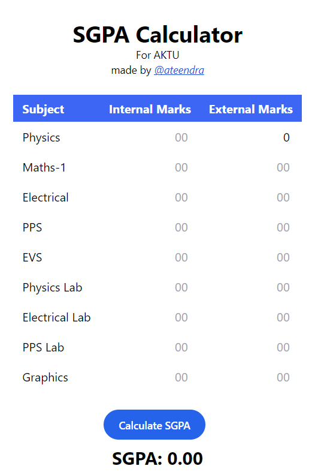

# React + Vite

# SGPA Calculator

## Overview

This project is a simple SGPA (Semester Grade Point Average) calculator. It allows users to input their grades and credit hours for each course in a semester, then calculates and displays the SGPA based on the input data.

## Features

- User-friendly console interface
- Input validation for grades and credit hours
- Accurate SGPA calculation based on user input

Link- https://ateendra24.github.io/React_Calculator/

This template provides a minimal setup to get React working in Vite with HMR and some ESLint rules.

Currently, two official plugins are available:

- [@vitejs/plugin-react](https://github.com/vitejs/vite-plugin-react/blob/main/packages/plugin-react/README.md) uses [Babel](https://babeljs.io/) for Fast Refresh
- [@vitejs/plugin-react-swc](https://github.com/vitejs/vite-plugin-react-swc) uses [SWC](https://swc.rs/) for Fast Refresh
